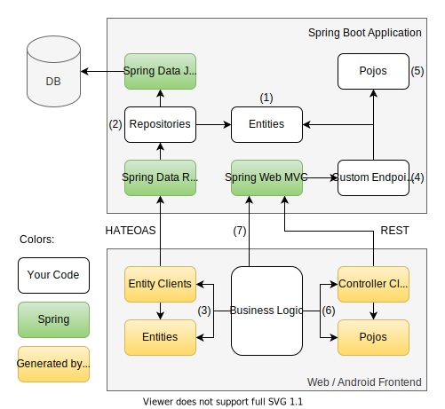

# Introduction

FeGen helps you write web and mobile apps with Spring Boot backends.
It does so by generating client code based on your Spring server, so you can access your Spring Data REST API in a type safe manner.
Typescript and Kotlin are supported as frontend languages, so you can use FeGen when creating a web app, a native Android app or another Spring application.

## Idea

With Spring Data Rest it is already very convenient to create a REST API to persist data by just specifying the data model using entities like this one:

```java
@Entity
public class Country {
    
    public long id;
    
    public String name;
    
    public int population;

    @OneToMany(mappedBy = "country")
    public List<City> cities;
}
```

You just need to specify matching repositories, and Spring Data Rest will provide you with a HATEOAS API that supports all CRUD operations:

```java
public interface CountryRepository extends JpaRepository<Country, Long> {}
```

If you want to e.g. create a new country from within a web application, you can now use the following code:

```typescript
const counrty = await fetch("http://example.com/countries", {
    method: "POST",
    body: {
        name: "Germany",
        population: 80_000_000,
        cities: []
    }
});
```

However, creating REST requests that conform to the HATEOAS that Spring expects can be quite cumbersome.
This is how you would add a city to a country:

```typescript
fetch("http://example.com/cities", {
    method: "POST",
    body: {
        name: "Dortmund",
        population: 600_000,
        counrty: counrty._links.self.href
    }
})
```

Although HATEOAS is not overly complicated, it is easy to make a mistake e.g. by misspelling the URL or a property name, using the wrong method or supplying an object as a related entity instead of a link.
Also, if you change your API later on, you will have to manually check for all the places in your frontend where you have used it.

This is where FeGen comes into play.
You can add it to your Spring Boot project, and it will look at the entities and repositories you defined and generate frontend code in Typescript or Kotlin so you can access your API without worrying about the HATEOAS details:

```typescript
const country = await apiClient.countryClient.create({
    name: "germany",
    population: 80_000_000,
    cities: []
});

apiClient.cityClient.create({
    name: "Dortmund",
    population: 600_000,
    country
});
```

As you can see, this has multiple advantages:

- You do not need to know how HATEOAS works
- Generated types for entities prevent mistakes and give you auto completion
- When you change your API, obsolete usages in your frontend will cause compiler errors, so you can easily spot and fix them
- The code is more readable as it better conveys its intent
- Less boilerplate code

As with Spring and Spring Data REST, with FeGen, you are not constrained to simple CRUD operations.
You can use paging, sorting, custom searches and projections to access your data.
Moreover, FeGen also generates code to access the methods within controllers.


## Architecture

This is how a full stack application using FeGen may be structured:



In the simplest case, you can just define some entities *(1)* as well as the corresponding repositories *(2)* and FeGen enables you to read and modify those entities from within your frontend code *(3)* as in the code examples you just saw.
If you need more fine-grained control, you can also define your own endpoints in a Spring controller *(4)* which may use entities or plain java classes that you defined *(5)* and FeGen will generate corresponding types and methods to invoke those endpoints *(6)*.
Finally, if you need to access an endpoint in a way that FeGen does not currently support (such as file up- or download), you can of course always directly access your Spring server from your frontend *(7)*.


## Getting started

If you are new to FeGen, please follow the [Quick Start Guide](./quickstart/intro.md) to get an idea of how FeGen works and how you can use it.
Once you finished the [Quick Start Guide](./quickstart/intro.md), you can go more into detail and e.g. learn how to use FeGen to access your backend from Android or another Spring application, by referring to the [Reference Documentation](./reference/intro.md).


